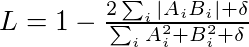

# Pipe segmentation using a convolutional auto-encoder

Michael J. Clark

*michael.clark at wassname.org*

*Draft 26 September 2016*

#### Abstract

Deep convolutional neural networks have been successful in a variety of computer vision tasks,  from face detection to handwriting recognition. Convolutional auto-encoders have been particularly successful at object segmentation [[2]](#2)[[3]](#3) in medical imaging, even with small data sets. This paper presents a proof of concept for a new application: pipe detection from aerial drone images. Our model is a convolutional autoencoder with inception blocks, batch-normalisation, strided convolution for downsampling, and skip connections with residual blocks. Data augmentation is utilised to train the model despite the small amount of input data, achieving approximately 73% accuracy. The full implementation (based on keras) and the trained network is available at http://github.com/wassname/pipe-segmentation.

### Introduction

Since 2012 [[8]](#8) convolutional neural networks have achieved state-of-the-art performance in difficult computer vision tasks such as segmentation and objection detection. These achievements are due to a number of factors including layered convolutional neural nets.

One type of neural network, the convolutional auto-encoder, has been particularly successful at object segmentation [[2]](#2)[[3]](#3) in medical imaging, where a class label is assigned to each pixel by inputting a region around it. In particular, these have been successful for small data sets if used with aggressive data augmentation [[3]](#3). This paper examines the similar problem of segmenting pipelines from aerial images. A solution will allow us to map pipelines from satellite and aerial images and enable further processing such as leak detection.

This paper takes a convolutional auto-encoder with many of the latest advances and applies it to a new application: segmenting water pipelines in aerial images. While the result is limited by a lack of annotated data, it provides as a proof of concept that convolutional auto-encoders can effectivly segment piplines from aerial images and promises greater accuracy with more input data.

### Data

Our input data was a small amount of annotated images; however, with aggressive data augmentation, the 46 images proved sufficient to train to a reasonable accuracy. The drone images were supplied under an open license by the Water Corporation of Western Australia at GovHack Perth 2016 event. Each image was captured by drone at a resolution of 0.8 cm2 per pixel and with height and width between approximately 8 m and 18.4 m.

For data augmentation, we used a range of flips, affine transforms, and jitter. The images were manually annotated and then split 1:2, saving 15 for test and 31 for training. These were augmented by a) random rotations up to 360 degrees, b) up to 80% horizontal and vertical translations, c) a zoom of 80%, d) shear of up to 10 degrees, and e) jitter of 5% for each colour channel [[8]](#8). In a final step, images were resized to 80 x 112 and cached.

### Model

*The model architecture. Every box is an inception module or convolution with the number of feature layers denoted in brackets. The output size is listed below each box and the coloured arrows denote different operations.*

*The inception module used in this paper, as originally proposed in [[5]](#5).*

Our model is a convolutional autoencoder much like the U-Net architecture [[3]](#3)[[4]](#4) but with inception modules instead of convolution blocks. The inception modules are those originally proposed in [[5]](#5) but with asymmetric convolutions. For example, a 3x3 convolution is replaced with a 3x1 convolution, then batch normalisation, then a 1x3 convolution. This approach gives similar results with fewer parameters. All weights were initialised using a scaled Gaussian distribution [[6]](#6). All convolution blocks were followed by batch normalisation then activation [[7]](#7). The activation used was leaky rectified linear units (LReLU) with a slope of -0.1x for inputs below zero.

Downsampling was performed using strided convolution followed by batch normalisation and a leaky ReLU activation. Upsampling was done using a 2x2 repeat of each cell. Each of these was followed by a 50% dropout during training and 0% dropout during testing. The skip connections linked identically sized layers between the encoder and decoder. The connections outputted the sum of the input and a residual block where a 1x1 convolution is followed by batch normalisation and scaling by 0.1.

The head consisted of 1x1 convolution followed by a hard sigmoid activation function. A hard sigmoid was chosen instead of a sigmoid because of our choice of a sensitive loss function. Where a hard sigmoid reached 0 and 1, a sigmoid only approached 0 or 1, leaving residual errors which our loss function was sensitive to. The hard sigmoid bypassed this and resulted in realistic accuracy rates.

### Training

We used a dice coefficient loss [[2]](#2) which is sensitive to small changes and suitable for masks which are a small fraction of the image. The loss *L* ranged from 1 to 0, where *A* is the true and *B* the predicted labels. The loss function is smoothed using the constant δ=1 which results in a

Optimisation used an Adam optimiser with Nesterov momentum[[1]](#1) with a learning rate of 0.0002 and a momentum decay of 0.004. After examining the variance of the data, we chose 300 samples per epoch as a representative sample of the input data. A batch size of 10 was used due to graphics card memory requirements. Training progressed for 160 epochs and reached a plateau.

### Results and Discussion

The final results gave an accuracy of 0.73 for the test data set and 0.745 for the training data set. Note that we evaluated the unaugmented training and testing data because the augmented training data had added variation which prevented a direct comparison with the test data. This small overfit hints at some model bias in which case a deeper model may produce better results.

The image below shows results and displays the weaknesses of this model. Firstly, it fails where foliage obscures large parts of the pipe, and secondly, it occasionally returns false positives for bleached wood or similar objects. This may be overcome with further training data or by using a region proposal network to evaluate pipe shaped regions.

|results|training|testing|
|-------|--------|-------|
|**accuracy**|0.745|0.73|
|**dice loss**|0.079|0.100|
|**mathews correlation coeffecient**|0.82|0.77|

*Results on unaugmented training and test data*

*Results for test data. Columns: (a) the input data, (b) the ground truth mask (c) the mask predicted by this model.*

### Conclusion

The 73% accuracy achieved is a proof of concept showing that a convolutional autoencoder can be effective for pipe segmentation in aerial or satellite images. This application allows us to extract pipeline locations from aerial images and will assist in further processing tasks such as defect or leak detection. These results are achieved despite the small amount of input data available, which shows that a small amount of data can be sufficient to train an initial segmentation model if aggressive data augmentation is used. A much higher accuracy could likely be achieved with more input data.

### References

<a id="1">1</a>: Dozat, Timothy. ["Incorporating Nesterov Momentum into Adam."](http://cs229.stanford.edu/proj2015/054_report.pdf) *cs229 Report*

<a id="2">2</a>: Milletari, Fausto, Nassir Navab, and Seyed-Ahmad Ahmadi. ["V-Net: Fully Convolutional Neural Networks for Volumetric Medical Image Segmentation."](https://arxiv.org/abs/1606.04797) *arXiv preprint arXiv:1606.04797* (2016).

<a id="3">3</a>: Ronneberger, Olaf, Philipp Fischer, and Thomas Brox. ["U-net: Convolutional networks for biomedical image segmentation."](http://arxiv.org/abs/1505.04597) *International Conference on Medical Image Computing and Computer-Assisted Intervention*. Springer International Publishing, 2015.

<a id="4">4</a>: Tyantov, Edward ["Kaggle Ultrasound Nerve Segmentation competition"](https://github.com/EdwardTyantov/ultrasound-nerve-segmentation) *Github repository*

<a id="5">5</a>: Szegedy, Christian, et al. ["Rethinking the inception architecture for computer vision."](https://arxiv.org/abs/1512.00567) *arXiv preprint arXiv:1512.00567* (2015).

<a id="6">6</a>: He, Kaiming, et al. ["Delving deep into rectifiers: Surpassing human-level performance on imagenet classification."](http://arxiv.org/abs/1502.01852) *Proceedings of the IEEE International Conference on Computer Vision*. 2015.

<a id="7">7</a>: Ioffe, Sergey, and Christian Szegedy. ["Batch normalization: Accelerating deep network training by reducing internal covariate shift."](http://arxiv.org/abs/1502.03167) *arXiv preprint arXiv:1502.03167* (2015).

<a id="8">8</a>: Krizhevsky, Alex, Ilya Sutskever, and Geoffrey E. Hinton. ["Imagenet classification with deep convolutional neural networks."](http://www.cs.toronto.edu/~fritz/absps/imagenet.pdf) *Advances in neural information processing systems*. 2012.
