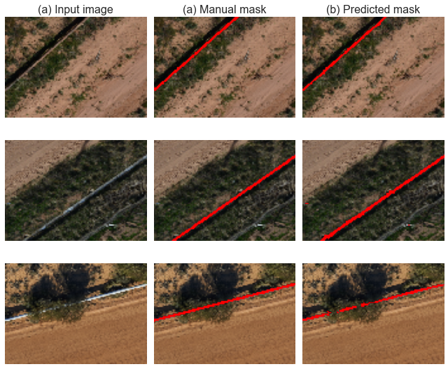
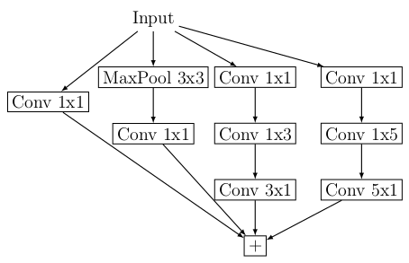

# Pipe segmentation using a convolutional auto-encoder

Michael J. Clark
*michael.clark at wassname.org*

*Draft 26 September 2016*

#### Abstract

Deep convolutional networks have been successful in a variety of computer vision tasks,  from facial recognition to handwriting recognition. Convolutional auto-encoders have been particulary successfull at object segmentation [^2][^3] in medical imaging even with small datasets. This paper presents a proof of concept for a new application: pipe detection from aerial drone images. We use a convolutional autoencoder with inception blocks, batch-normalisation, strided convolution for downsampling and skip connections with residual blocks. We show that data augumentation allows convergance for a small amount of input data, acheiving approximatly 70% accuracy. The full implementation (Based on keras) and the trained network is available at http://github.com/wassname/pipe-segmentation.

### Introduction

Since 2012 [^8] convolution nueral networks have acheived state-of-the-art performances in difficult tasks such as segmentation and objection detection. These acheivements are due to a number of factors including layered convolutional neural nets.

Convolutional auto-encoders have been particulary successfull at object segmentation [^2][^3] in medical imaging, where a class label is assigned to each pixel by inputing a region around each pixel. In particular these have been succesful for small datasets if used with aggressive data augumentation [^3]. A similar problem is segmentation of pipelines from aerial images. A solution to this problem will allow us map pipelines from sateling and aerial images and serve as a steping stone to further processesing such as leak detection.

This paper takes a convolution auto-encoder with many of the latest advances and applies it to a new application: segmenting water pipeline in aerial images. While the result is limited by a lack of annotated data it provides as a proof of concept for this application of computer vision and promises greater accuracy with more imput data.

### Data

Our source data were only 46 annotated aerial images but with carefull augumentation this was sufficient. These drone images were supplied by the Water Corporation of Western Australia at GovHack Perth 2016. Each image was captured by drone at a resolution of 0.8cm$^2$ per pixel and dimension between approx 8m and 18.4m. The images where manually annoted and then split 1:2, saving 15 for test and 31 for training. These where augumented by a) random rotations up to 360 degrees, b) up to 80% horizontal and vertical translations c) a zoom of 80% d) shear of up to 10 degrees d) jitter of 5% for each color channel [^8]. Finally images where resized to 80x112 and cached.

### Model

*The model architecture. Each box is a inception module or convolution with the number of feature layers denotes in brackets. The output size is denoted below the box and the arrows denote differen't operation.*

Our model is a convolutional autoencoder much like the U-Net architecture [^3][^4] but with inception modules instead of convolution blocks. The inception modules are those originally proposed in [^5] but with asymetric convolutions. For example a 3x3 convolution is replaced with a 3x1 convolution, then batch normalisaton, then a 1x3 convolution. This approach gives similar results with less parameters. All weights were initialised using a scalled gaussian distribution [^6]. All convolution blocks or individual layers were followed by batch normalization then activation [^7]. The actionvation used was leaky rectified linear units (LReLU) with a slope of -0.1x for inputs below zero.

Downsampling was done using strided convolution followed by batch normalization and a leaky ReLU activation. Upsampling was done using using a 2x2 repeat of each cell. Each of these was followed by a 50% dropout during training with no dropout during testing. The skip connections where made between the encoder and decoder. Each module consisted of the concatenation of a 1x1 convolution on the input and the input.

The output features were reduced using a 1x1 convolution then transformed by a hard sigmoid activation function. The hard sigmoid was chosen of a sigmoid because of our choice of a sensitive loss function. A hard sigmoid reaches 0 and 1 while  sigmoid only approaches 0 or 1, leaving residual errors which our loss function was sensitive too. The hard sigmoid bypasses this and resulted in realistic accuracy rates.

### Training

We used a Sørensen–Dice coefficient loss [^2] which is sensative to small changes and suitable for masks which are small feaction of the image. The loss $L$ ranged from 1 to 0, here $A$ and $B$ are the true predicted $B$ labels. The loss function is smoothed using the constant $\delta=1$ which results in a function approximating a linear L1 loss function.

$$ L = 1-\frac{ 2 \sum_i|A_i B_i|+ \delta}{\sum_i A_i^2 + B_i^2 + \delta}$$

Optimisation used an Adam optimizer with Nesterov momentum[^1] with a learning rate of 0.0002 and a momentum decay of 1e-5. After examining the varience of the data we chose 300 samples per epoch as a representative sample of the input data. A batch size of 10 was chosen due to graphics card memory requirements. Training progressed for 160 epochs and reached a plateau.

### Results

The final results gave an accuracy of 0.702 for the test dataset and 0.709 for the training dataset. This small overfit hints at bias in which case a deeper model may produce better results.

The image below shows the weaknesses of this model 1) it fails where foliage obscures large parts of the pipe, and it occasionally presents false positives for bleached wood or similar objects.

Note that we evaluated the unaugmented training and testing data because the augmented training data having added variablitly which prevented a direct comparison with the test data.

results|training|testing
-|-|-
**accuracy**|0.709|0.702
*Results on unaugumented training and test data*

*Results for test data. (a) the input data, (2) the ground truth mask (2) the mask predicted by this model.*

### Conclusion

The 70% accuracy acheived is a proof of concept showing that a convolutional autoencoder can be effective for pipe segmentation in aerial or satelite images. This application allows us to extract pipeline location from aerial images and serves as a step in further processing piplines such as defect or leak detection. These results are despite the small amount of input data available, which shows that a small amount of data can be sufficient to train an initial segmentation model if aggressive data augumentation is used. A much higher accuracy could likely be acheived with more input data.

### Appendix

*The inception module used in this paper, as originally proposed in [^5].*

### References
[^1]: http://cs229.stanford.edu/proj2015/054_report.pdf "Incorporating Nesterov Momentum into Adam"
[^2]: https://arxiv.org/pdf/1606.04797v1.pdf "V-Net: Fully Convolutional Neural Networks for Volumetric Medical Image Segmentation"
[^3]: http://arxiv.org/abs/1505.04597 "U-Net: Convolutional Networks for Biomedical
Image Segmentation"
[^4]: https://github.com/EdwardTyantov/ultrasound-nerve-segmentation ""
[^5]: https://arxiv.org/pdf/1512.00567v3.pdf "Rethinking the Inception Architecture for Computer Vision"
[^6]: http://arxiv.org/pdf/1502.01852v1.pdf "Delving Deep into Rectifiers: Surpassing Human-Level Performance on ImageNet Classification"
[^7]: http://jmlr.org/proceedings/papers/v37/ioffe15.html "Batch Normalization: Accelerating Deep Network Training by Reducing Internal Covariate Shift"
[^8]: http://www.cs.toronto.edu/~fritz/absps/imagenet.pdf "ImageNet Classification with Deep Convolutional
Neural Networks"
